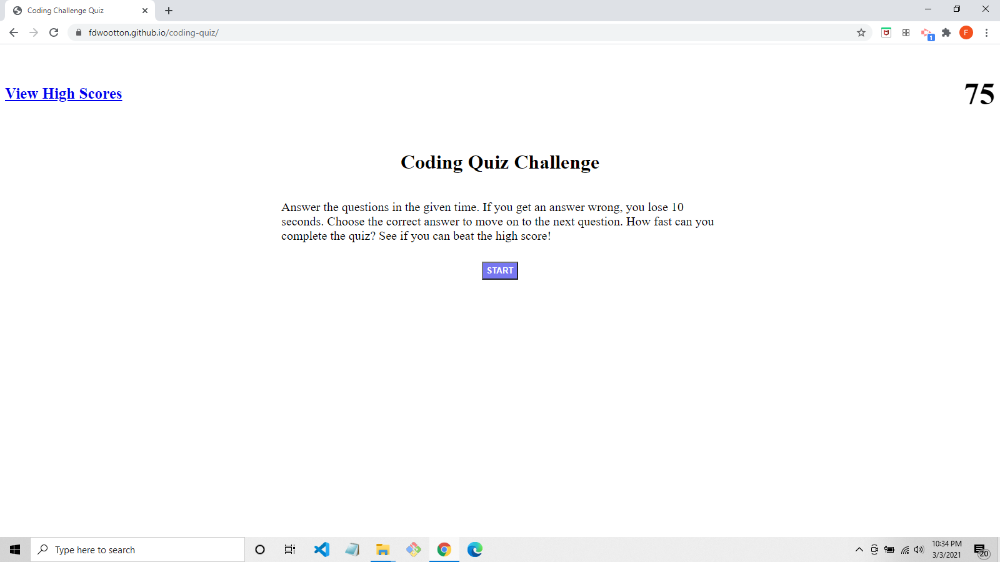

# Coding Quiz

This application is a quiz built using CSS, JavaScript, and the functionality of Local Storage.  The quiz is made up of five questions that test your coding knowlege. You are given 75 seconds to answer the questions.  If you choose an incorrect answer, you lose 10 seconds from your time. If you choose the correct answer, you are allowed to proceed to the next question.  Once you answer all the questions or the time runs out, you may input your initials to save your score.

# Project Status

This quiz is a work in progress. There are still a few bugs that need to be worked out. The high scores page does not present each new score on a new line. The multiple choice options are not randomly shuffled. The quiz will be updated and improved as I continue to develop my programming skills.

[Coding Quiz](https://fdwootton.github.io/coding-quiz/)

